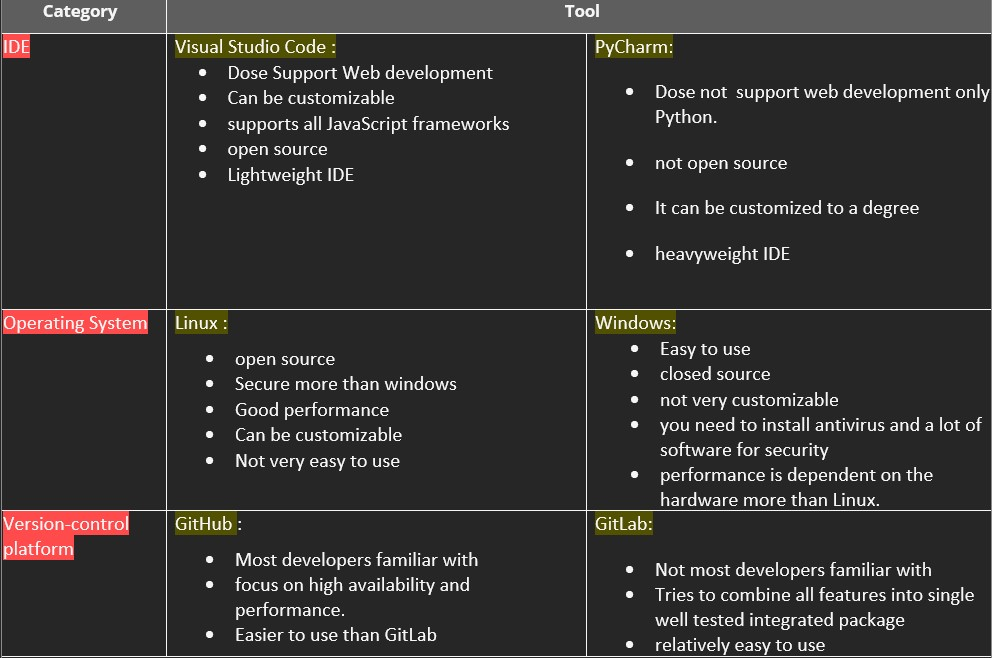

# Tooling  

## Task two (1,2,3)

## software development tools and techniques review

## **First IDE's :**

## A) VSCode 

Visual Studio Code is a simple yet capable source code editor for Windows, macOS, and Linux that runs on  desktop. It provides built in support for JavaScript, TypeScript, and Node.js, as well as a large ecosystem of extensions for additional languages like (such as C++, C#, Java, Python, PHP, and Go) (such as .NET and Unity).
Visual Studio Code blends the ease of use of a source code editor with advanced developer features such as IntelliSense code completion and debugging.

## B) Pycharm

PyCharm is a Python Integrated Development Environment (IDE) that includes a variety of important tools for Python developers that are closely integrated to offer a pleasant environment for effective Python, web, and data science development.

## **Second Operating System** 

## A) Linux

Linux is a Unix-like operating system for PCs, servers, mainframes, mobile devices, and embedded devices that is open source and community driven. It is one of the most extensively maintained operating systems since it runs on virtually every major computer platform, including x86, ARM, and SPARC.

## B) Windows 

Microsoft's Windows operating system is a desktop operating system. Windows has become the most used OS for personal devices for the past 3 decades. Windows comes with a graphical user interface that comprises a desktop with icons and a task bar that is by default shown at the bottom of the screen. Users can launch numerous windows in Windows' "File Explorer."

## **third Version-control platform**

## A) GitHub

GitHub is a site that hosts Git repositories, but it also has a lot of its own features. GitHub is a Web-based graphical interface for Git, which is a command-line program. For each project, it also includes access control and many collaborative capabilities, such as wikis and rudimentary task management tools.

## B) Gitlab

GitLab is a single-app DevOps platform that is radically altering the way development, security, and operations teams interact and produce software. GitLab helps organizations minimize development expense and time to market by boosting application performance from idea to production, reducing project duration from weeks to minutes.

## **our choices for the Project** :
In Table Form  :

In Text : 
## **First IDE** :

we picked **VSCode** over pysharm , becuse we are making bsaic web application without any use of python and VScode's features are all we need about VSCode is lightning-fast source code editor, it is ideal for everyday usage. Syntax highlighting, bracket-matching, auto-indentation, box-selection, snippets, and more are all available in VSCode, which supports hundreds of languages. You can add intuitive shortcut keys, simple customization, and community-contributed keyboard shortcut mappings, all those features is what any developer dream to have in a IDE.

## **Second Operating System** :

we picked **linux** ubuntu distro  for many reasons , it's all around the fact it's open source . so, Linux is regarded as a more secure operating system than Windows. There is no need for antivirus software. Because it is open source, it has a large number of developers working on it, and anybody may contribute code.also just row performance was a big factor in picking linux ,it's just  more powerful and adaptable operating system than Windows for web development . Linux is lightweight, making it quicker than Windows. When anyone starts working with a Linux distribution, will notice a substantial increase in speed.

## **Third Version-control platform** :

we picked **GitHub**, this pick was a tricky one , becuase both opations were good enough for us , but we went with what our developers familiar with to save their time , when researching github and gitlab we found the difference between them is GitHub focuses on high availability and performance of its fundamental core functions, outsourcing tangential or difficult aspects to other tools ,GitLab strives to combine all features into a single, well-tested and well-integrated package. 

