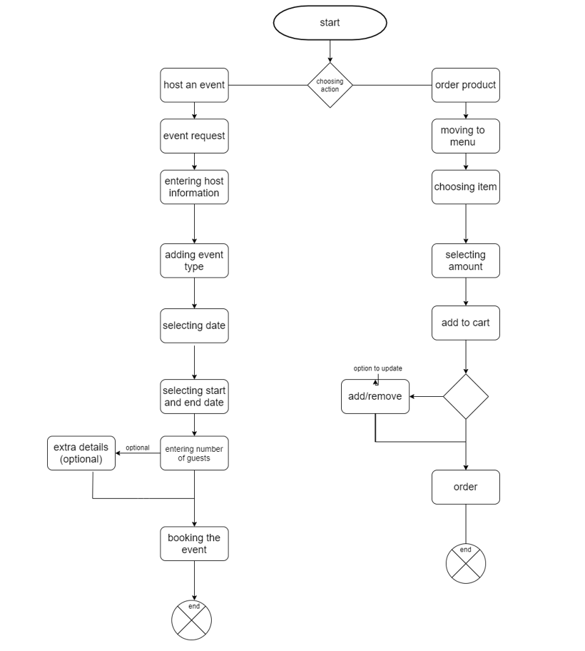
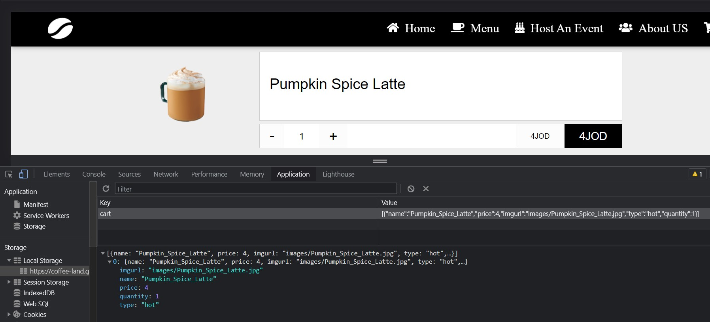

# Stage 1: Project Design   

# Task one (1,2,3):

# 1 -

Our business-related problem is " Selling coffee online " , a cafe owner wants to have the ability to sell his cafe products online , and he wants his customers to be able to view products online anytime they  want, and to have all the info about his business in one place, where the customers know where to Communicate and ask Questions about anything related to the business, also the website needs to look good , to Attract new customers and keep the current ones and the website also should store all sales data.
# 2 -

 Risks :

  1. Using local storage instead of real database.
  2. Not Having enogh time to finish the project. 
  3. Not using the right technology for the project.
  4. Having a design debt, meaning low quality design that results in a future cost.
  5. Change In project requirements from the owner.
  6. Writing bad code that is not that scalable.
  7. Data lose, loss of data that can't be restored.
  8. having Poor Data quality 

# 3 -

# Activity Digram :
   Activity Digram depicts business and software operations as a series of actions. People, software components, and computers can all do these tasks. Flow charts are used to record the development of system processes as well as to explain business operations and use scenarios.

# Databsase 

Note : We did't Use any Database in this project , we used local Storage to store our data in the menu and the Cart ..

 
And this is the only Data we Store in the Cart and the menu and in the whole project...
# Wireframe :
A wireframe is a web page layout that shows what interface components will be present on important pages. It's an important step in the interface design process. Wireframes may also be used to build the global and secondary navigation, ensuring that the site's vocabulary and structure fit user expectations.
The Wirefram for our website: 
## **Home** :
.jpg)
## **Host An Event page** :
.jpg)
## **Cart** :
.jpg)
## **Menu** :
.jpg)
## **About Us** :
.jpg)

# Coding and implementation technique :

We will Follow the code style we have learned throughout this course. We will use meaningful and descriptive names for all files, variables, function names. We will Follow best practices with casing, spacing, and indentation.
Our team will decide on standard naming conventions to use throughout the project and hold each other accountable to these standards.
The code base should also follow similar code organization from file to file. For example, all the files that affect application styling will follow similar patterns and syntax.

# Testing technique

White Box testing , because we don't have QA team , testing is mostly done by  developers , who have knowledge about the internal structure of the code of the software.

# List of requirements
 

1. Works as expected with no bugs
2. Has All the needed pages with clear navigation, one of which must be an"About Us"page.
3. State is persisted between page reloads.
4. User Can view All proudcts.
5. User Can order any product .
6. user Can check All products that he/she ordered in A cart page.
7. user Can Host an Event in our Coffee shop By filling the details online.
8. add nice CSS to the website.
 

